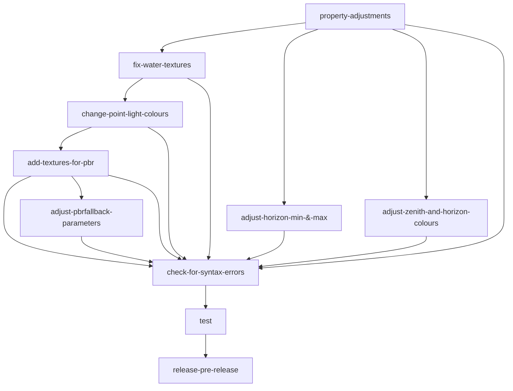

> [!IMPORTANT]
> This shader is recommended to be used on mid to high end devices. low end devices may experience lag due to Vibrant Visuals. Though, running this shader without any other mods can be the fix to the performance hit, Using multiple mods at once can be the issue, or you can install performance mods that uses culling.

> [!NOTE]
> this is not finished yet, more progress will be done on this github soon and so will the shader! below is just a made readme for the future. everything in this shader can be changed in the future.

# NADIRS
NADIRS, or Noirvaze's Amazing Deferred Immersive Shader, is a Minecraft Bedrock Edition Shader that has a realistic touch to its lighting. As a Bedrock player with a desktop that doesn't perform games as great, my only option was to use my Ipad, but there were only a few shaders on websites you can use and Java has way more. So I thought if I could just make one myself.
> NADIRS is not finished yet, everything is subject to change.

## progress board


| Tasks | Finished? | Notes |
| :---         |     :---:      |          ---: |
| property adjustments   | Work in Progress     | adjustments are still needed    |
| fix water textures     | No       | I dont have the textures yet, though this is planned for the future      |
| change point light colours | Work in progress (65%) | currently changing, will update to ```yes``` once everything looks good, though since all lights are point lights it may cause lag. |
|add textures for pbr | Work in progress | currently adding textures, will adjust pbr settings once complete |
|adjust pbrfallback parameters | Work in progress | may take time to perfect it. |
|check for syntax errors | No | not there yet. |
| test | No | not there yet. |
| release pre-release | No | not ready yet, though you can compile it yourself by commands or downloading the zip. not recommended though |
### Commits
Alternatively, you can just view my recent commits and see what has changed in detail.

# Download, Installation & Compatability
Below is information about installling and compatability.

## Minecraft version and Compatability
For NADIRS to work, you <ins>must</ins> have:
> - Mincraft Bedrock Edition <sup>( Windows, IOS or Android )</sup>
> - Version 1.21.80.25 and up to have access to Vibrant visuals/Deferred Technical Preview

## Installation
Unlike Java, Bedrock edition has a way easier way of importing and installing resource packs. _It doesnt require anything else!_

1. Download the latest release in the [Release page](https://github.com/noirvaze/NADIRS/releases)
2. Go to the downloaded mcpack and click it, if nothing happens, share it to minecraft to open it on minecraft
3. done! just go to your global resources or open an existing/create a new one, and activate it!
_Enjoy your new experience._

### Downloads
- [Releases](https://github.com/noirvaze/NADIRS/releases)

<details>
  <summary>
    Notes
  </summary>
  This shader is still in its works, you can view progress by viewing commits. If you want to use this while development is still being made <sub>( this is not recommened )</sub>, compile by using your command prompt <sub>( windows )</sub>, download [git](https://git-scm.com/), and type `git clone https://github.com/noirvaze/NADIRS.git` to clone. use cd to select the folder location to clone in, or make a new one by typing md.
</details>

### if you have any questions, please contact me through discord ( @noir_studios ) or email ( noirvaze@icloud.com )
